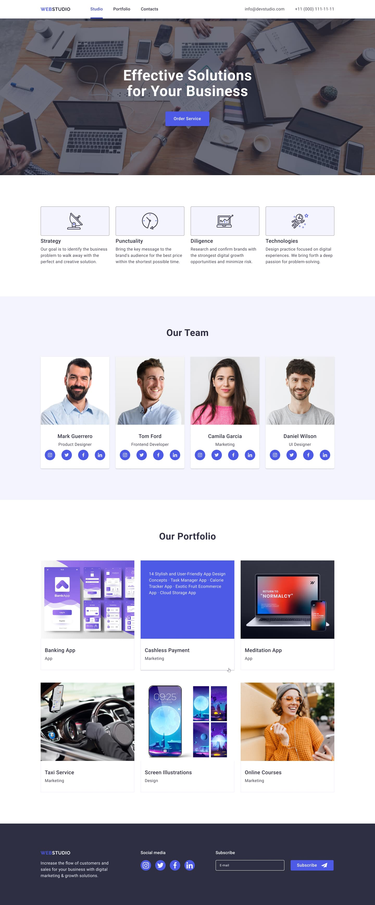
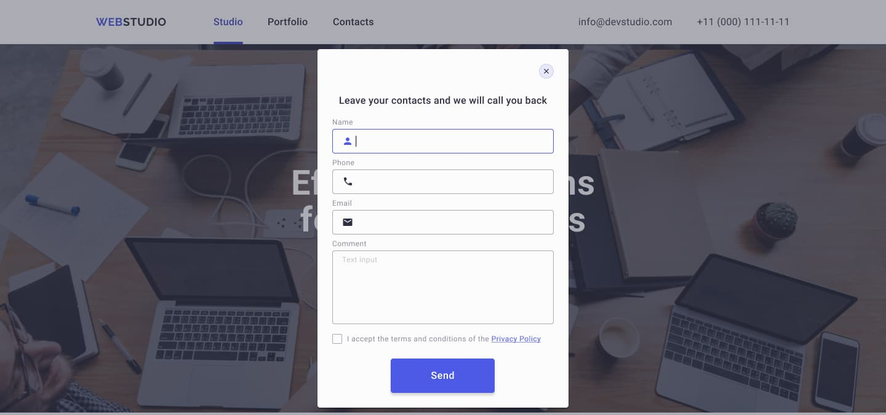
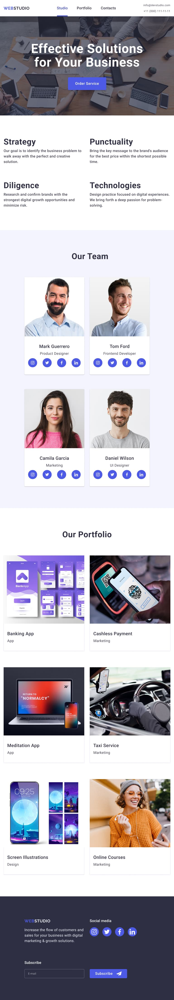
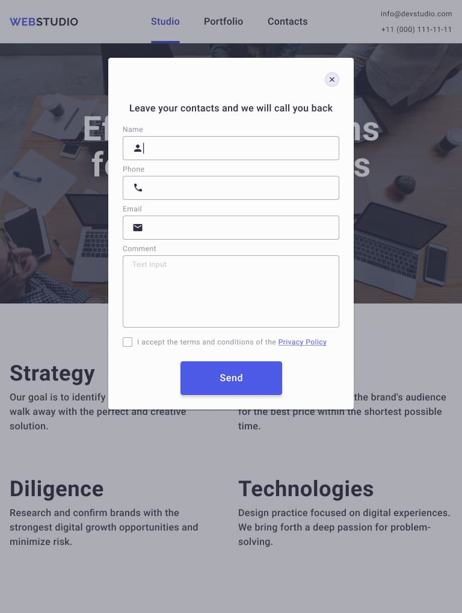
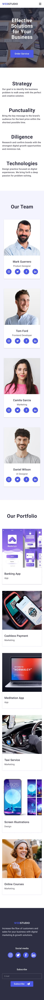
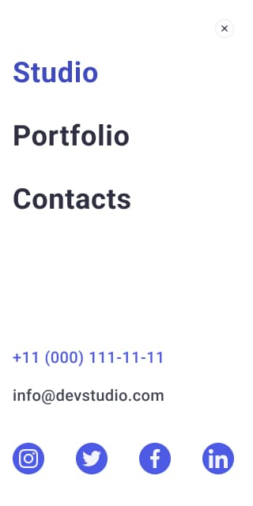

# HW6

**Завдання**

- Виконай верстку адаптивної версії всіх елементів сторінки.

  - desktop

  

  

  - tablet

  

  

  - mobile

  

  

  

- Налаштуй GitHub Pages і додай посилання на живу сторінку в секцію About
  GitHub-репозиторія.
